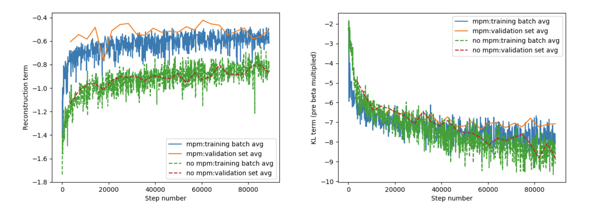
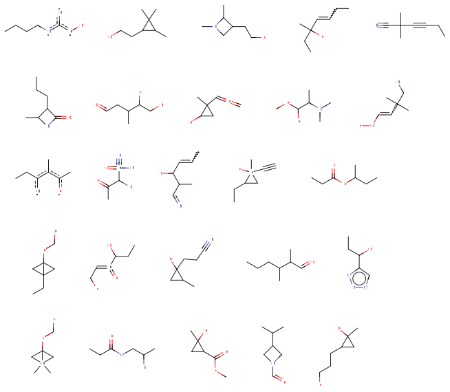

# GraphVAE

My implementation of [1].
This implementation is based  on the one at https://github.com/JiaxuanYou/graph-generation [2], but with a sole
focus on molecular graphs.
Note that we do not completely match the hyper-parameters/architectures suggested in [1].

1. Simonovsky M., Komodakis N. (2018) GraphVAE: Towards Generation of Small Graphs Using Variational Autoencoders. In: Kůrková V., Manolopoulos Y., Hammer B., Iliadis L., Maglogiannis I. (eds) Artificial Neural Networks and Machine Learning – ICANN 2018. ICANN 2018.
 Lecture Notes in Computer Science, vol 11139. Springer, Cham. 
 Following: http://arxiv.org/abs/1802.03480 & https://openreview.net/forum?id=SJlhPMWAW.
2. Jiaxuan You*, Rex Ying*, Xiang Ren, William L. Hamilton, Jure Leskovec, 
GraphRNN: Generating Realistic Graphs with Deep Auto-regressive Model (ICML 2018)
 

## Installation
* We are using Python 3.6, PyTorch 1.1. Easiest to install on a GPU machine using the `conda_environment.yml` file.
* Note the submodules when cloning this repo, ie do `git submodule init` and `git submodule update` after cloning.
* We have a bash script that can setup the Python Path correctly. 
If you want to use this you can do so by eg `source set_up.sh`.
* We're using pytest for the tests.
* We have a dockerfile (which also lists the requirements). To use build it, eg  `docker build -t johnbradshaw/graph-vae .`
and then to run it eg ` docker run -it johnbradshaw/graph-vae:latest` (or ` docker run -it johnbradshaw/graph-vae:latest  bash` 
to put you in a bash shell inside the container). This currently does not take advantage of the GPU.
 
 
## Scripts
### Training
Run `scripts/train_graphvae.py` for training the VAE. Will produce weights at end and Tensorboard log files as we train.

_Fig1: Training losses for QM9 Dataset_

### Sampling
Run `scripts/sample_graphvae.py` for sampling from the prior of a trained VAE.

_Fig2: QM9 Samples from trained VAE prior (VAE trained with graph matching)_

 
## Notation in comments
Tried to use the following notation consistently when adding comments to the code:

`b` the batch size  
`e` the number of edge types  
`v` the number of nodes for adjacency matrix in one graph  
`v*` the number of stacked active nodes in all the graphs    
`E*` the number of edges in all the graphs  
`h` the dimension of the node representation      
`[...]` corresponding array/tensor shape. eg `[2,4]` signifies a 2 by 4 matrix
`g` the number of groups

## Data Sources
* QM9, `qm9_smiles.txt`. Taken from `https://ndownloader.figshare.com/files/3195389`, following
 https://github.com/microsoft/constrained-graph-variational-autoencoder/blob/master/data/get_qm9.py
* Zinc, `250k_rndm_zinc_drugs_clean.txt`: Taken from https://github.com/mkusner/grammarVAE
This contains the elements: `{'Br', 'C', 'Cl', 'F', 'I', 'N', 'O', 'P', 'S'}` in molecules containing 6-38 atoms (we
don't count Hydrogen). 249456 items.

